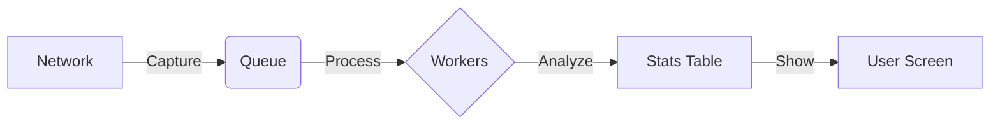

# 🌐 Real-Time Network Traffic Analyzer

> **A high-performance tool that captures and analyzes network packets in real-time.** 🚀


## 🤔 What is this?

Imagine standing by a busy highway and counting every single car, truck, and bike that passes by, noting where they came from and where they are going—**without slowing down the traffic**.

This project does exactly that for your computer network! It listens to the digital "traffic" (packets) flowing through your network card and tells you:
*   **Who** is talking (Source IP/Port).
*   **To Whom** they are talking (Destination IP/Port).
*   **How much** data they are sending.
*   **How fast** it's happening (Packets Per Second).

## ⚡ Why is it special?

*   **Fast & Furious**: Used **Multi-threading** so it captures and processes data at the same time. It won't miss a beat! 🧵
*   **Smart Memory**: Uses a special "Bounded Queue" to handle traffic spikes. If the traffic is too heavy, it safely drops the excess instead of crashing. 🛡️
*   **Live Dashboard**: Shows you what's happening *right now* on your screen. 📺

## 🛠️ How it Works (Under the Hood)

1.  **Capture (The Ear)**: One thread uses `libpcap` to listen to the raw wire.
2.  **Queue (The Buffer)**: Packets are put into a thread-safe box.
3.  **Workers (The Brains)**: Multiple worker threads take packets out of the box, parse them (read the address labels), and update the statistics.
4.  **Reporter (The Screen)**: Every second, it prints the top "conversations" (Flows) to your console.



## 🚀 How to Run It (Linux)

You need a Linux system (or WSL on Windows) to run this because it touches the hardware network interface.

### 1. Install Dependencies
```bash
sudo apt-get update
sudo apt-get install build-essential cmake libpcap-dev
```

### 2. Build the Project
```bash
mkdir build
cd build
cmake ..
make
```

### 3. Run It!
You need `sudo` (admin rights) to capture packets.
```bash
sudo ./traffic_analyzer -i eth0
```
*(Replace `eth0` with `wlan0` if you are on WiFi)*

## 📊 Example Output

When you run it, you'll see a live dashboard like this:

```text
=== Network Traffic Analyzer ===
Queue Size: 12  |  Drops: 0
--------------------------------
Top 5 Active Flows:
1. 192.168.1.5:443   -> 10.0.0.2:51234  [TCP]  (1,204 pkts)
2. 192.168.1.5:80    -> 10.0.0.2:51240  [TCP]  (850 pkts)
3. 8.8.8.8:53        -> 10.0.0.2:32001  [UDP]  (120 pkts)
...
```

## 🤝 Contributing
Feel free to fork this project and submit Pull Requests! 🌟
