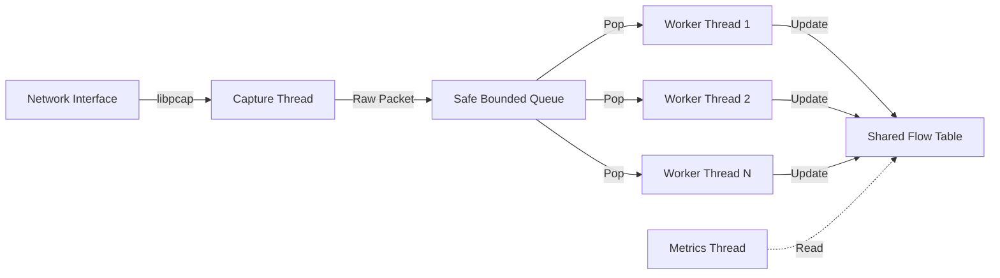

# 🚀 High-Performance Multi-Threaded Network Traffic Analyzer


A high-throughput, real-time network traffic analyzer built in C++ specifically for Linux systems. Designed with a producer-consumer architecture to handle high packet rates without dropping critical data, leveraging `libpcap` for capture and a thread pool for parallel flow processing.

## 🔥 Key Features

- **⚡ Real-Time Capture**: Direct interface with network cards using `libpcap` optimized for speed.
- **🧵 Multi-Threaded Architecture**: Dedicated capture thread + configurable worker pool for zero-latency processing.
- **🛡️ Thread-Safe & Bounded**: Implements a custom **Bounded Blocking Queue** with drop policies to handle burst traffic gracefully.
- **📊 Flow Analytics**: Tracks unique flows (5-tuple: IP/Port/Proto) with packet and byte counters.
- **📈 Live Metrics**: Console dashboard updates every second with PPS (Packets Per Second), drop rates, and top talkers.

## 🏗️ Architecture

The system uses a **Leader-Follower / Producer-Consumer** pattern:



## 🛠️ Build Instructions

### Prerequisites
- Linux (Native or WSL2)
- C++17 Compiler (g++ or clang)
- CMake 3.10+
- `libpcap-dev`

```bash
# Ubuntu/Debian
sudo apt-get update
sudo apt-get install build-essential cmake libpcap-dev
```

### Compile
```bash
# Clone the repository
git clone https://github.com/Shivansh0306/NetworkTrafficAnalyzer.git
cd NetworkTrafficAnalyzer

# Build
mkdir build && cd build
cmake ..
make
```

## 🚀 Usage

**Note**: Root privileges are required to capture packets in promiscuous mode.

```bash
sudo ./traffic_analyzer -i <interface>
```

**Example:**
```bash
sudo ./traffic_analyzer -i eth0
```

### 🖥️ Dashboard Output
```text
=== Network Traffic Analyzer ===
Queue Size: 42
Total Drops (Queue): 0
Total Drops (Pcap): 0
--------------------------------
Top 5 Flows (by Packets):
192.168.1.105:54322 -> 142.250.182.174:443 [TCP] Pkts: 1250 Bytes: 85032
192.168.1.105:32112 -> 8.8.8.8:53 [UDP] Pkts: 45 Bytes: 3020
...
```

## 📂 Project Structure

```
├── include/           # Header files
│   ├── SafeQueue.h    # Thread-safe queue implementation
│   ├── FlowTable.h    # Shared state for flow tracking
│   └── ...
├── src/               # Source implementation
│   ├── CaptureEngine.cpp # Libpcap wrapper
│   ├── Worker.cpp     # Consumer logic
│   └── main.cpp       # Entry point
├── CMakeLists.txt     # Build configuration
└── README.md          # Documentation
```

## 🤝 Contributing

Contributions, issues, and feature requests are welcome!

## 📄 License

This project is licensed under the MIT License.
